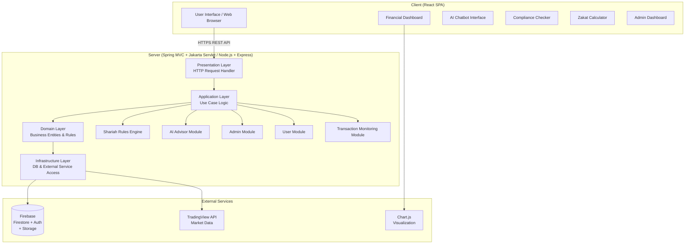
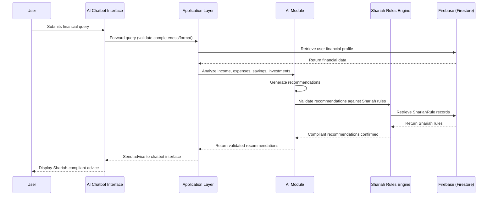
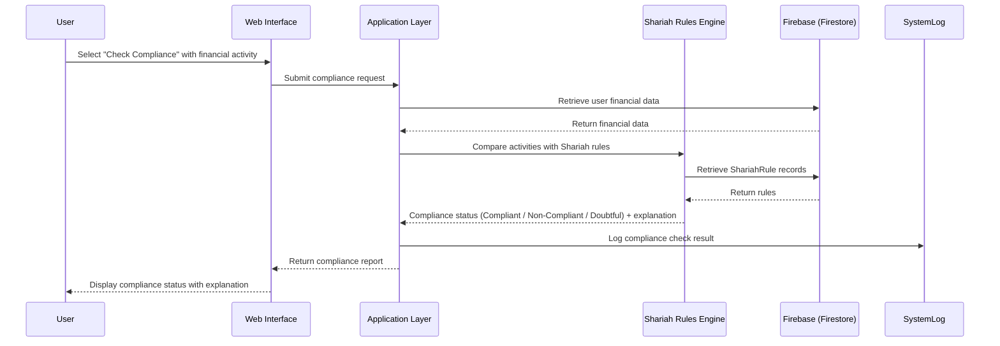

# TDD.md

| Field | Value |
|---|---|
| **Document Name** | Technical Design Document – ITQAN AI Islamic Finance Advisor |
| **Version** | Based on SDS Version No. 2; SRS Version No. 1 |
| **Date** | SDS Initial: 25-12-2025; SDS Revision 01: 14-1-2026 |
| **Status** | Partially Complete (system design proposed; full implementation pending PSM2) |
| **Source Reference** | FYP Report + SRS (SECJ 3032, Semester 01, 2025/2026) + SDS (Version No. 2) + STD (Version No. 1) — Universiti Teknologi Malaysia, Faculty of Computing |
| **Brief Explanation** | This TDD is derived strictly from the ITQAN source documents. It details architecture, component breakdown, data design, interface design, technology stack, runtime interactions, integrations, deployment context, and constraints as documented in the FYP Report, SRS, SDS, and STD. |

---

# 1. Architecture (As Described)

## 1.1 Architectural Style

The ITQAN Islamic Financial Advisory Website uses **client–server architecture** as the main architectural style, combined with **Clean Architecture principles** to guarantee separation of concerns, scalability, and maintainability of the system.

The system is also described in the SDS as a single-page application (SPA) on the frontend (React) communicating with the backend via REST API (secured HTTPS).

## 1.2 Layer Responsibilities (Exact as Documented)

| Layer | Side | Documented Responsibility |
|---|---|---|
| **Presentation Layer** (Client) | Client | This is the web-based front end developed using modern web technologies. The customer side is charged with the primary task of communicating with user authentication, inputting financial data, page navigation, and displaying AI-generated financial advice. The client provides secured API calls to the server. All asynchronous requests — like submitting financial profile information or seeking AI advice — are handled asynchronously so that the user can have a smooth and responsive experience. The client does not communicate directly with data storage or business logic. |
| **Presentation Layer** (Server) | Server | All client requests are received at the presentation layer. It receives the HTTP request of the client, verifies the contents, and sends the corresponding replies. The layer is not only the client communicating point but also the point of communication between the client and the system in general. |
| **Application Layer** | Server | The main application logic of the ITQAN system. It manages all interactions of users and the system by implementing use cases such as providing AI-based Shariah-compliant financial advice, user account management, and monitoring financial objectives. This layer manages commands that modify data and queries that retrieve information, ensuring that all actions are within stipulated business rules and workflows. |
| **Domain Layer** | Server | The central section of the ITQAN system. It implies the significant business entities and regulations, which comprise financial profiles, advisory rules, and user data. The domain layer uses Islamic financial principles and ensures that the system will make out Shariah-compliant recommendations. |
| **Infrastructure Layer** | Server | The lowest level of the server architecture. It combines external services and data persistence. This layer helps with communication with the database that stores user profiles, financial data, and advisory results. It also enables the integration of AI services and authentication mechanisms. The infrastructure layer provides technical implementations while being independent from the business logic. |

---

# 2. System Component Model

## 2.1 Component Breakdown (Exact as Documented)

| Component / Module | Description |
|---|---|
| **User Module** | Custom module to generate and handle financial profiles; user registration, authentication, and profile management. |
| **AI Advisor Module** | Creates Shariah-compliant financial advice; processes user financial data, generates recommendations, validates against Shariah rules. |
| **Transaction Monitoring Module** | Monitors user financial operations for compliance and analysis. |
| **Admin Module** | System management for administrators; manages user accounts, monitors system performance, manages Shariah rules. |
| **Shariah Rules Engine** | Deterministic module that filters candidate financial instruments based on configurable rules (sector exclusions, revenue-from-haram thresholds, financial ratios like debt). Rules are stored in the database, versioned, and auditable. |
| **AI Chatbot Interface** | Allows users to submit financial queries in natural language and receive real-time Shariah-compliant guidance. |
| **Zakat Calculator** | Computes Zakat based on user's financial data and current Nisab thresholds. |
| **Compliance Checker** | Verifies whether financial activities comply with Shariah rules and logs results. |
| **Financial Dashboard** | Displays financial trends, progress, goal tracking, AI recommendations, and compliance alerts. |
| **Admin Dashboard** | Provides real-time metrics, logs of user actions, user management, and Shariah rules management. |
| **Firebase Integration** | Real-time database (Firestore), user authentication, cloud storage, cloud functions, hosting. |
| **React Frontend** | Single-page application; reusable components for dashboard, AI chatbot interface, goal-tracking panels. |

## 2.2 Component Diagram (As Documented — Mermaid)

---

# 3. Technology Stack (Exact as Documented)

## 3.1 Core Technologies

| Technology | Role |
|---|---|
| React (SPA) | Frontend UI framework |
| Spring MVC + Jakarta Servlet | Backend REST API layer |
| Node.js | Backend runtime environment |
| Express.js | Web application framework |
| Firebase (Firestore + Auth) | NoSQL database, authentication, cloud storage, cloud functions, hosting |
| NLP Frameworks | AI chatbot natural language processing |
| Machine Learning Models | Financial analysis and Shariah-compliant recommendation generation |
| Python AI | AI/ML computation (referenced in Chapter 3 summary) |
| MySQL / PostgreSQL | Relational database (compatibility requirement) |

## 3.2 External Software Interfaces and Versions (Exact as Documented)

| Name | Mnemonic | Spec Number | Version | Source |
|---|---|---|---|---|
| Firebase (Realtime Database & Authentication) | FB | FDB-2025-ITQ | 9.22.0 | https://firebase.google.com/ |
| ReactJS (Framework) | RJS | REACT-2025 | 18.2.0 | https://reactjs.org/ |
| Node.js (Backend Runtime Environment) | NJS | NODE-2025 | 20.1.0 | https://nodejs.org/ |
| Express.js (Web Application Framework) | EXP | EX-2025 | 4.18.2 | https://expressjs.com/ |
| Material-UI (UI Component Library) | MUI | MUI-2025 | 5.15.6 | https://mui.com/ |
| Chart.js (Data Visualization) | CHR | CH-2025 | 4.3.0 | https://www.chartjs.org/ |
| VS Code (IDE) | VSC | VSC-2025 | 1.91.0 | https://code.visualstudio.com/ |
| Git (Version Control) | GIT | GIT-2025 | 2.42 | https://git-scm.com/ |

---

# 4. System Requirements (Exact as Documented)

## 4.1 Software Requirements

| Software | Version | Purpose |
|---|---|---|
| Firebase (Realtime Database & Authentication) | 9.22.0 | NoSQL Firestore database, real-time synchronization, user auth, cloud storage, cloud functions, hosting |
| React | 18.2.0 | Frontend SPA framework; reusable component-based UI; virtual DOM for performance |
| Node.js | 20.1.0 | Backend runtime environment |
| Express.js | 4.18.2 | Web application framework |
| Material-UI | 5.15.6 | UI component library |
| Chart.js | 4.3.0 | Data visualization |
| Visual Studio Code | 1.91.0 | IDE for development and debugging |
| Git | 2.42 | Version control |
| Jira | [Not stated in source] | Agile project management |
| PostgreSQL or MySQL | [Not stated in source] | Backend database compatibility |

## 4.2 Hardware Requirements

| Component | Specification |
|---|---|
| Server RAM | Minimum 8 GB |
| Server Processor | Quad-core (multi-core CPU) |
| Server Storage | Minimum 100 GB |
| Server OS | Linux/Windows |
| Server Hosting | Cloud-based; virtualized |
| Client Devices | Desktop, laptop, tablet, smartphone |
| Client RAM (minimum) | 2 GB RAM |
| Client Processor | Minimum 1 GHz |
| Client Screen Resolution | Minimum 1366×768 |
| Client Browser | Modern web browser (Chrome, Firefox, Edge, Safari) |
| Developer Device RAM | Minimum 8–16 GB RAM |
| Developer Storage | 250–500 GB |
| Internet | Minimum 1 Mbps; stable connection |

---

# 5. Data Design

## 5.1 Persistent Entities (Exact as Documented)

| Entity / Table Name | Description |
|---|---|
| User | Stores user account information such as name, email, role, and authentication details |
| FinancialProfile | Stores user financial data including assets, liabilities, income, and savings |
| FinancialGoal | Stores user-defined financial goals and progress tracking information |
| Advice | Stores AI-generated Shariah-compliant financial recommendations |
| ShariahRule | Stores Islamic financial rules and references used by the advisory engine |
| Admin | Stores administrator credentials and access permissions |
| SystemLog | Stores metadata such as user actions, timestamps, and system activities |

## 5.2 Entity Purposes

| Entity Name | Description |
|---|---|
| User | Core user account entity; manages identity, authentication, and role assignment |
| FinancialProfile | Contains all financial data entered by the user; drives AI analysis and recommendations |
| FinancialGoal | Tracks user-defined savings and investment goals and their progress |
| Advice | Persists AI-generated, Shariah-validated recommendations for each user |
| ShariahRule | Acts as the knowledge base for the Shariah Rules Engine and advisory validation |
| Admin | Provides administrator-specific access controls and credentials |
| SystemLog | Provides audit trail of all user and system actions for compliance and monitoring |

## 5.3 Data Dictionary (Per-Entity Attribute Tables)

### Entity: User (Exact as Documented)

**Table 5.5: users**

| Attribute | Data Type | Description |
|---|---|---|
| userId | String (PK) | Unique identifier for each user |
| name | String | Full name of the user |
| email | String | User's email address for login and notifications |
| passwordHash | String | Encrypted password for secure login and 2FA |
| phone | String | User's phone number (optional) |
| address | Object | User's address details |
| address.state | String | User's city/state |
| address.zip | String | User's ZIP/postal code |
| userType | String | Role of the user (either Admin or User) |
| createdDate | Timestamp | Date and time when the user account was created |

### Entity: FinancialProfile (Exact as Documented)

**Table 5.5: FinancialProfile**

| Attribute | Data Type | Description |
|---|---|---|
| profileId | String (PK) | Unique identifier for each financial profile |
| userId | String (FK) | Identifier of the user who owns the profile |
| income | Float | Total monthly or annual income of the user |
| assets | Float | Total assets owned by the user |
| liabilities | Float | Total liabilities owed by the user |
| savings | Float | Current savings amount |
| createdDate | Timestamp | Date and time when the profile was created |
| updatedDate | Timestamp | Date and time of the last update |

### Entity: FinancialGoal (Exact as Documented)

**Table 5.5: FinancialGoals**

| Attribute | Data Type | Description |
|---|---|---|
| goalId | String (PK) | Unique identifier for each goal |
| userId | String (FK) | Identifier of the user who owns the goal |
| goalType | String | Type of goal (e.g., savings, investment) |
| targetAmount | Float | Goal target amount |
| currentAmount | Float | Current progress toward the goal |
| status | String | Status of the goal (active, completed, paused) |
| deadline | Date | Target completion date |
| createdDate | Timestamp | Date when the goal was created |
| updatedDate | Timestamp | Date of the last update |

### Entity: Advice (Exact as Documented)

**Table 5.5: Advice**

| Attribute | Data Type | Description |
|---|---|---|
| adviceId | String (PK) | Unique identifier for each advice record |
| userId | String (FK) | Identifier of the user receiving the advice |
| adviceType | String | Type of advice (e.g., savings, investment, Zakat planning) |
| description | Text | Details of the financial recommendation |
| createdDate | Timestamp | Date and time when the advice was generated |
| ruleId | String (FK) | Reference to the ShariahRule used in generating advice |

### Entity: ShariahRule (Exact as Documented)

**Table 5.5: ShariahRules**

| Attribute | Data Type | Description |
|---|---|---|
| ruleId | String (PK) | Unique identifier for each Shariah rule |
| category | String | Rule category (e.g., Zakat, investment) |
| description | Text | Explanation of the rule |
| sourceReference | String | Reference source or book for the rule |

### Entity: SystemLog (Exact as Documented)

**Table 5.5: SystemLog**

| Attribute | Data Type | Description |
|---|---|---|
| logId | String (PK) | Unique identifier for each log entry |
| userId | String (FK, optional) | Identifier of the user associated with the action |
| actionType | String | Type of action performed (e.g., login, updateProfile) |
| timestamp | Timestamp | Date and time of the action |
| details | Text | Additional information about the action |

### Entity: Admin (Exact as Documented)

**Table 5.5: Admin**

| Attribute | Data Type | Description |
|---|---|---|
| adminId | String (PK) | Unique identifier for each administrator |
| name | String | Full name of the admin |
| email | String | Admin email address |
| role | String | Admin role (Super Admin, Moderator) |
| lastLogin | Timestamp | Last login date and time |

---

# 6. Interface Design

## 6.1 User Interfaces

The ITQAN UI is developed using React as the main framework and is designed to be intuitive, responsive, and user-friendly. Key screens/interfaces documented are:

| Screen | Description |
|---|---|
| **User Dashboard** | Main hub after login; displays last activities, AI suggestions, Zakat calculations, and financial insights. Navigation leads to core features. |
| **AI Chatbot** | Virtual assistant for financial queries; processes text input and displays real-time Shariah-compliant responses; maintains chat history. |
| **Compliance Checker** | User enters financial transaction details; system provides immediate compliance feedback with explanations and suggested actions. |
| **Zakat Calculator** | User enters assets, income, and savings; computes Zakat liabilities with dynamic, real-time breakdown. |
| **Financial Dashboard** | Detailed overview of savings, investments, and AI-generated suggestions; uses charts and summaries. |
| **Admin Dashboard** | Monitors system performance, manages user accounts, tracks financial activity, generates reports, manages Shariah rules. |
| **Registration/Login Page** | Account creation and secure login; includes 2FA and password recovery options. |
| **Financial Profile Page** | Form to create/edit financial profile (income, assets, liabilities, savings); displays confirmation on success. |
| **Financial Goals Page** | Define financial goals, set target amounts, monitor progress (progress bars, notifications, milestone alerts). |

The UI supports screen resolutions from 320px (mobile) up to 1920px (desktop).

## 6.2 Communication Interfaces

**Table 5.6: Local and Network Communication (Exact as Documented)**

| Interface | Purpose | Protocol / Standard | Description / Notes |
|---|---|---|---|
| Client Browser ↔ Web Server | Exchange requests and responses between the user interface and server backend | HTTP / HTTPS (TLS 1.2+) | All data transmitted over encrypted HTTPS for secure communication; supports RESTful API requests/responses using JSON format |
| Web Server ↔ Firebase Realtime Database | Store and retrieve user data, financial profiles, goals, and advice | HTTPS (TLS 1.2+) | Data transmitted as JSON objects; secure authentication via Firebase Auth tokens |
| Web Server ↔ External APIs | Access market data, currency rates, or other financial data | HTTPS / REST API | Standard JSON responses; token-based authentication for API calls |
| Internal Components | Communication between Node.js backend modules and AI advisory engine | TCP/IP / API calls | Low-latency communication within cloud server environment; message format defined in Internal ITQAN API specification |
| Notifications Delivery | Send alerts to user devices (browser notifications or email) | WebSocket (browser) / SMTP (email) | WebSocket for real-time in-browser notifications; SMTP for email delivery; messages formatted as JSON or standard email templates |

**Table 5.6: Required Software Interface (Exact as Documented)**

| Interface | Message Content / Format | Purpose | Reference Document |
|---|---|---|---|
| ITQAN ↔ Firebase Realtime Database | JSON objects transmitted over HTTPS; fields include userId, profileId, goalId, adviceId, timestamps | Store and retrieve user profiles, financial data, goals, and advice | Firebase API Documentation (https://firebase.google.com/docs/database) |
| ITQAN ↔ Firebase Authentication | Authentication tokens (JWT) sent over HTTPS | Authenticate users, manage login sessions, and 2FA | Firebase Auth Documentation (https://firebase.google.com/docs/auth) |
| ITQAN ↔ React Front-end | REST API JSON responses containing user data, advice, goals, and notifications | Display UI elements and interact with users | ITQAN API Design Document v1.0 |
| ITQAN ↔ Chart.js | JSON datasets formatted for Chart.js graphs (labels, values, colors) | Render dynamic visualizations of financial goals and advisory data | Chart.js Documentation v4.3.0 |
| ITQAN ↔ Admin Report Generator | CSV, PDF files generated via Node.js server and accessible through secure links | Generate downloadable reports for user activities, financial analysis, and advisory outputs | ITQAN Report Specification v1.0 |

---

# 7. Runtime Interaction & Data Flow

## 7.1 AI Chatbot / Financial Advisory Execution Flow

## 7.2 Shariah Compliance Check Flow

---

# 8. Integration Details

## 8.1 Firebase Integration (Exact as Documented)

- Provides secure cloud hosting, real-time database storage, and user authentication.
- Uses Firestore, a NoSQL database, to synchronize financial data, goals, and user preferences instantly across devices and browser sessions.
- Supports third-party authentication methods such as Google Sign-In, simplifying account creation and login for web users.
- Offers cloud storage for documents.
- Provides serverless cloud functions for backend operations.
- Provides real-time notifications.
- Enables ITQAN to operate as a fast, scalable, and secure web platform without heavy server management.
- Communication uses JSON objects over HTTPS (TLS 1.2+) with JWT tokens.

## 8.2 TradingView API Integration (Exact as Documented)

- Used to obtain the required stock data (e.g., company classification/sector and financial indicators that will be needed to screen data).
- Supports business activity screening (permissible and non-permissible sectors/activities).
- Supports financial ratio screening (threshold-based analysis with the adopted Shariah parameters in the project).

## 8.3 Chart.js Integration (Exact as Documented)

- Renders dynamic visualizations of financial goals and advisory data.
- Communicates via JSON datasets formatted for Chart.js graphs (labels, values, colors).
- Version 4.3.0.

## 8.4 Admin Report Generator Integration (Exact as Documented)

- Generates downloadable reports for user activities, financial analysis, and advisory outputs.
- CSV and PDF files generated via Node.js server.
- Files are accessible through secure links.

---

# 9. Deployment & Operations Context

## 9.1 Hosting Environment

- The backend is stored on cloud servers working with Linux/Windows and using HTTP/HTTPS protocols.
- Server requirements: Multi-core CPU, 8 GB+ RAM, and expandable storage to support database and AI processing.
- Database and application servers are virtualized to provide flexibility and load balancing.
- Firebase provides hosting services for the web application.
- Standard web ports are used: 80 for HTTP, 443 for HTTPS.
- TLS 1.2+ is used for secure data transfer.

## 9.2 Operational Dependencies

| Dependency | Purpose |
|---|---|
| Firebase Platform | Real-time database, authentication, cloud storage, cloud functions |
| Internet Connectivity | Minimum 1 Mbps stable connection for real-time synchronization and API calls |
| TradingView API | Market data access for stock Shariah screening |
| AI/ML Service | NLP and machine learning computation for chatbot and recommendations |
| Modern Web Browser | Client-side access (Chrome, Firefox, Edge, Safari — latest two versions) |

## 9.3 Operations Phase Notes

- The **maintenance phase** ensures that the deployment of the ITQAN AI Islamic Financial Advisor System remains active and addresses the changing needs of the users.
- It is the process of observing the performance of the systems, solving bugs or any other arising issues, adjusting the AI algorithms to emerging financial regulations or user needs, and upgrading the functionalities of the systems through continuous feedback.
- The **review phase** handles gathering and analyzing feedback from stakeholders and end users at the end of each development sprint.
- Scheduled maintenance must occur outside peak hours, with downtime notifications provided to users.
- The system should be operational at least 99.5% of the time annually.

---

# 10. Constraints

## 10.1 Scope Constraints ("The System Will Not")

- The system does not cover personal budgeting (tracking income/expense).
- The system does not cover integrating banking transactions.
- The system does not cover trade execution.
- The system does not cover portfolio management.
- The system does not cover pay processing.
- The system does not cover any payout/approval processes that are not related to stock Shariah screening.

## 10.2 Design Constraints (As Documented)

1. **Environmental**: The system must operate reliably in environments with internet connectivity speeds as low as 1 Mbps.
2. **Hardware**: Server minimum of 8 GB RAM, quad-core processor, 100 GB storage; End User devices with at least 2 GB RAM and 1 GHz processor.
3. **Security**: All user data must be encrypted using AES-256 encryption; user authentication must use MFA; role-based access control must be enforced for Admin and Shariah Advisor accounts.
4. **Compatibility**: Web browsers Chrome, Firefox, Edge, and Safari (latest two versions); Mobile OS Android 10+ and iOS 13+; backend services compatible with PostgreSQL or MySQL.
5. **Modular Architecture**: The system is constructed using a modular approach comprising a web-based interface, an AI-powered recommendation engine, application logic for financial advisory, and a persistent data storage layer.
6. **Clean Architecture**: Server-side must follow Clean Architecture layers (Presentation, Application, Domain, Infrastructure).
7. **Data Security**: Passwords stored using salted hashes (bcrypt); role-based access control for admin endpoints; users can export and delete their data.
8. **Regulatory**: The system must comply with applicable data protection laws, Islamic finance regulations, and financial advisory guidelines.

## 10.3 Performance/Capacity Constraints (Exact as Documented)

| Constraint | Value |
|---|---|
| Response time — basic operations (dashboard, profile) | Within 2 seconds |
| Response time — AI chatbot responses (standard queries) | Within 3 seconds |
| Response time — compliance check result | Within 3 seconds |
| Concurrent user sessions (SRS requirement) | At least 500 without performance degradation |
| Concurrent users (design constraint) | At least 1,000 with response times under 5 seconds |
| AI recommendation requests throughput | At least 50 per second |
| Minimum registered users (initial) | 10,000, scalable to 100,000 |
| System availability | At least 99.5% annually |
| AI financial analysis per user request | Within 3 seconds |
| Report generation (large dataset) | Within 8 seconds |
| AI analysis (large dataset, 12 months) | Within 10 seconds |
| Minimum internet speed | 1 Mbps |
