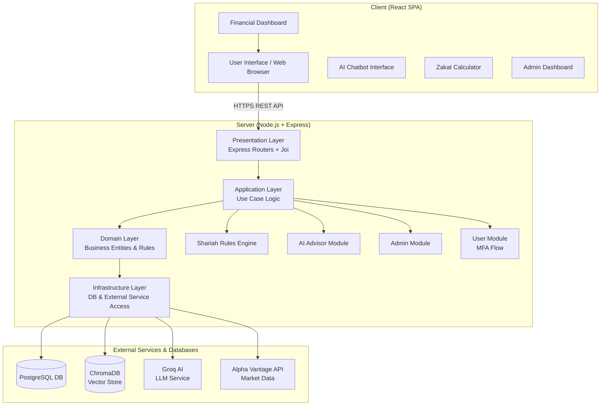
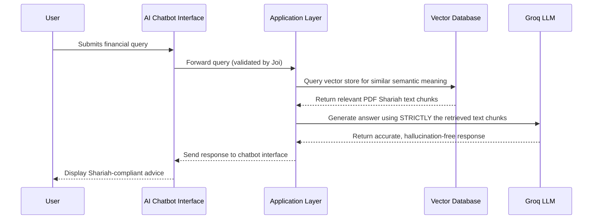

# TDD_FINAL.md

| Field | Value |
|---|---|
| **Document Name** | Technical Design Document (FINAL) – ITQAN AI Islamic Finance Advisor |
| **Version** | 2.0 (Finalized Implementation) |
| **Date** | June 2026 (System finalized and completed) |
| **Status** | Final / Fully Complete |
| **Source Reference** | FYP Report + SRS + SDS + STD — Universiti Teknologi Malaysia, Faculty of Computing |
| **Brief Explanation** | This TDD reflects the *completed* state of the ITQAN system. It updates the architecture, integrations, and deployment context to represent the implemented stack (PostgreSQL, Groq AI, ChromaDB RAG, Alpha Vantage API). Unchanged elements remain identical to the original draft. |

---

# 1. Architecture (Finalized)

## 1.1 Architectural Style

The ITQAN Islamic Financial Advisory Website uses **client–server architecture** as the main architectural style, combined with **Clean Architecture principles** to guarantee separation of concerns, scalability, and maintainability of the system.

The system is deployed as a single-page application (SPA) on the frontend (React) communicating with the backend (Node/Express) via REST API over secured HTTPS.

## 1.2 Layer Responsibilities (Finalized)

| Layer | Side | Documented Responsibility |
|---|---|---|
| **Presentation Layer** (Client) | Client | This is the web-based front end developed using React. It is charged with communicating with user authentication, inputting financial data, page navigation, and displaying AI-generated financial advice. The client provides secured API calls to the server asynchronously. The client does not communicate directly with data storage or business logic. Handles i18n English/Arabic routing. |
| **Presentation Layer** (Server) | Server | All client requests are received at the Express.js API routers. It receives the HTTP request of the client, verifies the contents strictly via **Joi validation middleware**, and sends the corresponding replies. |
| **Application Layer** | Server | The main application logic of the ITQAN system. It manages all interactions of users and the system by implementing use cases such as providing AI-based Shariah-compliant financial advice (via RAG), user account management (via JWT/bcrypt MFA), and monitoring financial objectives. |
| **Domain Layer** | Server | The central section of the ITQAN system. It implies the significant business entities and regulations, which comprise financial profiles, advisory rules, and user data. The domain layer uses Islamic financial principles stored in PostgreSQL and ChromaDB to ensure that the system will make out Shariah-compliant recommendations. |
| **Infrastructure Layer** | Server | The lowest level of the server architecture. It connects to the **PostgreSQL** database that stores user profiles, financial data, and advisory results. It integrates with **Groq SDK**, **ChromaDB**, and **Alpha Vantage API**. |

---

# 2. System Component Model

## 2.1 Component Breakdown (Finalized)

| Component / Module | Description |
|---|---|
| **User Module** | Custom module to generate and handle financial profiles; user registration, authentication (MFA via OTP), and profile management natively in PostgreSQL. |
| **AI Advisor Module** | Creates Shariah-compliant financial advice using Groq LLM; processes user financial data and generates recommendations. |
| **Transaction Monitoring Module** | Monitors user financial operations for compliance and analysis. |
| **Admin Module** | System management for administrators; manages user accounts, monitors system performance, manages Shariah rules. |
| **Shariah Rules Engine** | Deterministic module that filters candidate financial instruments based on configurable rules in PostgreSQL and live financial data from Alpha Vantage. |
| **AI Chatbot Interface** | Allows users to submit financial queries in natural language and receive real-time Shariah-compliant guidance via a RAG vector DB. |
| **Zakat Calculator** | Computes Zakat based on user's financial data and current Nisab thresholds. |

| **Financial Dashboard** | Displays financial trends, progress, goal tracking, AI recommendations, and compliance alerts. |
| **Admin Dashboard** | Provides real-time metrics, logs of user actions, user management, and Shariah rules management. |
| **Vector DB (ChromaDB)** | Stores mathematical embeddings of Shariah documentation (PDFs) for instantaneous retrieval. |
| **React Frontend** | Single-page application; reusable components translated via react-i18next (English/Arabic). |

## 2.2 Component Diagram (Finalized)

---

# 3. Technology Stack (Finalized)

## 3.1 Core Technologies

| Technology | Role |
|---|---|
| React (SPA) | Frontend UI framework |
| react-i18next | Multi-language translation layer |
| Node.js | Backend runtime environment |
| Express.js | Web application framework |
| PostgreSQL | Core relational database handling users, profiles, rules, and logs |
| Groq LLM | Fast inference AI engine |
| ChromaDB | Local vector store for the RAG architecture |
| Joi | Request data validation middleware |

## 3.2 External Software Interfaces and Versions (Finalized)

| Name | Mnemonic | Version | Source |
|---|---|---|---|
| PostgreSQL (Database) | PG | 14.x+ | https://postgresql.org/ |
| ReactJS (Framework) | RJS | 18.2.0 | https://reactjs.org/ |
| Node.js (Backend Runtime) | NJS | 20.1.0 | https://nodejs.org/ |
| Express.js (Web Framework) | EXP | 4.18.2 | https://expressjs.com/ |
| Groq (AI Inference) | GROQ | Latest | https://console.groq.com/ |
| ChromaDB (Vector Store) | CHR | Latest | https://trychroma.com/ |
| Alpha Vantage (Market Data) | AV | Latest | https://www.alphavantage.co/ |
| Material-UI / Chart.js | MUI/CH | 5.15.6 / 4.3.0 | https://mui.com/ |

---

# 4. System Requirements

## 4.1 Software Requirements

| Software | Version | Purpose |
|---|---|---|
| PostgreSQL | Latest | Relational DB replacement for Firebase |
| React | 18.2.0 | Frontend SPA framework; reusable component-based UI; virtual DOM for performance |
| Node.js | 20.1.0 | Backend runtime environment |
| Express.js | 4.18.2 | Web application framework |
| Joi | Latest | Validation middleware |
| react-i18next | Latest | Internationalization |
| Groq SDK | Latest | Connects to the Groq LLM API |

## 4.2 Hardware Requirements

| Component | Specification |
|---|---|
| Server RAM | Minimum 8 GB |
| Server Processor | Quad-core (multi-core CPU) |
| Server Storage | Minimum 100 GB |
| Client Devices | Desktop, laptop, tablet, smartphone |

---

# 5. Data Design

## 5.1 Persistent Entities (Finalized PostgreSQL Tables)

| Entity / Table Name | Description |
|---|---|
| users | Stores user account information such as name, email, role, and authentication details |
| mfa_tokens | Temporary OTP tokens for 2-step Multi-Factor Authentication |
| financial_profiles | Stores user financial data including assets, liabilities, income, and savings |
| financial_goals | Stores user-defined financial goals and progress tracking information |
| advice | Stores AI-generated Shariah-compliant financial recommendations |
| shariah_rules | Stores Islamic financial rules and references used by the advisory engine |
| system_logs | Stores metadata such as user actions, timestamps, and system activities |

---

# 6. Interface Design

## 6.1 User Interfaces

The ITQAN UI is developed using React as the main framework and is designed to be intuitive, responsive, and user-friendly. Key screens/interfaces documented are:

| Screen | Description |
|---|---|
| **User Dashboard** | Main hub after login; displays last activities, AI suggestions, Zakat calculations, and financial insights. Navigation leads to core features. |
| **AI Chatbot** | Virtual assistant for financial queries; processes text input and displays real-time Shariah-compliant responses backed by RAG. |

| **Zakat Calculator** | Computes Zakat liabilities dynamically. |
| **Admin Dashboard** | Monitors system performance, manages user accounts, tracks financial activity, and manages Shariah rules. |
| **Registration/Login Page** | Account creation and secure login; includes MFA (Multi-Factor Authentication) OTP screens. |

The UI fully supports **English and Arabic** out-of-the-box. When Arabic is selected, all CSS properties dynamically switch to **Right-To-Left (RTL)** layout to accommodate native reading patterns.

---

# 7. Runtime Interaction & Data Flow

## 7.1 AI Chatbot RAG Execution Flow

---

# 8. Integration Details (Finalized)

## 8.1 PostgreSQL Custom Integration
- Replaced Firebase as the core data store. Uses `pg` (node-postgres) to securely interact with relational data. Ensures ACID compliance for user financial data.

## 8.2 Alpha Vantage Integration
- Fetches real-time financial balance sheet metrics required by AAOIFI Rule 21. 
- A 1-hour time-to-live (TTL) memory cache wraps the API calls to prevent rate-limiting on high-traffic days.

## 8.3 RAG (ChromaDB + Groq) Integration
- A dedicated `ingest.js` script processes the root `Islaamic_Sharia_Law_sunni.pdf` via `pdf-parse`, generating semantic embeddings stored locally in ChromaDB. 
- Groq executes Lightning-fast Llama-3 inference strictly constrained by the retrieved PDF texts.

---

# 9. Deployment & Operations Context

## 9.1 Hosting Environment

- The backend is stored on cloud servers working with Linux/Windows and using HTTP/HTTPS protocols.
- Server requirements: Multi-core CPU, 8 GB+ RAM, and expandable storage to support database and AI processing.
- The `VITE_API_URL` environment variable coordinates frontend-to-backend communication.

## 9.2 Operational Dependencies

| Dependency | Purpose |
|---|---|
| PostgreSQL | Primary database |
| ChromaDB | RAG Vector database |
| Alpha Vantage API | Market data access for stock Shariah screening |
| Groq API | LLM computation for chatbot and recommendations |

---

# 10. Constraints

## 10.1 Design Constraints (Finalized)

1. **Security**: All user data encrypted; user authentication strictly uses MFA (email OTP); role-based access control enforced.
2. **Modular Architecture**: Server-side follows Clean Architecture layers. Data flows through Express -> Joi Middleware -> Controllers.
3. **Data Security**: Passwords stored using salted hashes (bcrypt); custom JWT issues stateless session tokens.
4. **Regulatory**: The system complies with applicable data protection laws, Islamic finance regulations, and financial advisory guidelines (via the RAG architecture).

## 10.2 Performance/Capacity Constraints

| Constraint | Value |
|---|---|
| Response time — basic operations | Within 2 seconds |
| Response time — AI chatbot responses (Groq) | Within 3 seconds |

| Minimum internet speed | 1 Mbps |
